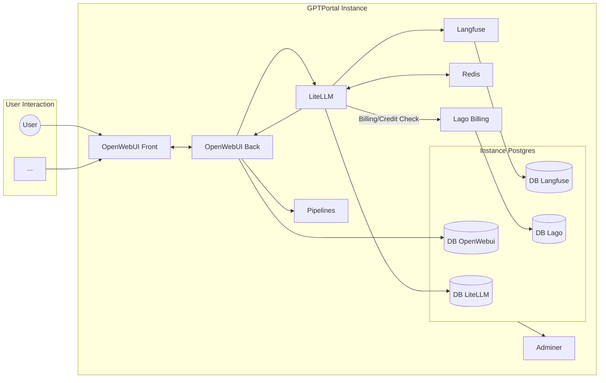
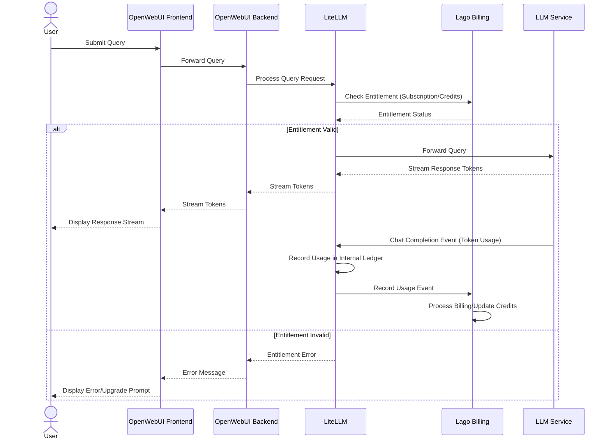

# Architecture: GPTPortal (Based on Open WebUI)

## Status: Draft (Reverse Engineered)

## Technical Summary
GPTPortal utilizes the Open WebUI platform, providing a web interface for interacting with Large Language Models (LLMs). The core architecture consists of a frontend UI, a backend API server, and an LLM service (typically Ollama). These components are containerized using Docker for ease of deployment and scalability. The system is designed to be extensible, particularly regarding information retrieval (RAG) capabilities, as outlined in the OpenWebUI roadmap. Communication between the frontend and backend is via HTTP requests, and the backend communicates with the LLM service over its API.

## Technology Stack
| Technology  | Component/Purpose              | Notes                                      |
|-------------|--------------------------------|--------------------------------------------|
| SvelteKit   | Frontend Framework             | Provides the reactive web user interface   |
| TypeScript  | Frontend/Backend Language      | Used for type safety in the frontend       |
| TailwindCSS | Frontend Styling               | Utility-first CSS framework                |
| Python      | Backend Language               | Handles API requests, business logic, LLM integration |
| FastAPI/Starlette | Backend Framework (likely) | High-performance Python web framework      |
| Ollama      | LLM Service                    | Primary backend for LLM interaction        |
| Docker      | Containerization               | Packages application components            |
| Docker Compose | Orchestration (Development)  | Defines and runs multi-container services  |
| Kubernetes  | Orchestration (Production)     | Support available for deployment           |
| SQLite/Files| Data Storage (Default)         | Persists user data/configs via volume mount|

## Architecture Diagrams
(High-level diagram based on the provided image, including Lago)



## Project Structure (Key Components)
```
/src/                # Frontend SvelteKit application source
/backend/            # Backend Python application source
/static/             # Static assets for frontend
/Dockerfile          # Builds the combined frontend/backend container
/docker-compose*.yaml # Docker Compose files for service orchestration
/kubernetes/         # Kubernetes deployment manifests
/.ai/                # AI-assisted development documentation (PRD, Arch, Stories)
```

## Data Models/Schemas
- Primarily managed by the backend service.
- User data, chat history, settings, RAG documents stored in the `/app/backend/data` volume within the `open-webui` container.
- Specific schema details reside within the backend codebase (e.g., database models if using an ORM).

## User Query with Entitlement Check Sequence

The following diagram illustrates the flow of a user query through the system, including entitlement checking and usage-based billing:



This sequence ensures that:
1. User queries are validated against subscription status or available credits
2. Only authorized and entitled queries are processed by the LLM
3. Usage is accurately tracked and billed based on actual token consumption
4. Users receive immediate feedback on entitlement issues

*For more implementation details, refer to the LiteLLM and Lago integration documentation.*

## Change Log
| Date        | Change                            | Story | Notes                                    |
|-------------|-----------------------------------|-------|------------------------------------------|
| $(date +%Y-%m-%d) | Initial Reverse Engineering       | -     | Draft architecture based on codebase analysis |
| 2024-07-11 | Added Lago Billing & updated diagrams | -     | Integrated Lago for metric billing. |
| 2024-07-11 | Added Entitlement Check Sequence Diagram | - | Detailed user query flow with checks. |
| 2024-07-13 | Added User Query Sequence Diagram with Entitlement | - | Added detailed sequence flow for query processing with subscription checks and billing. |
| 2024-07-13 | Updated Sequence Diagram with Usage Ledger | - | Added step to record token usage in Ledger system. |
| 2024-07-13 | Updated Sequence Diagram - Ledger as Internal Feature | - | Corrected diagram to show Usage Ledger as internal LiteLLM feature. |

*For more detailed component interactions and features, please refer to the official OpenWebUI documentation.*
